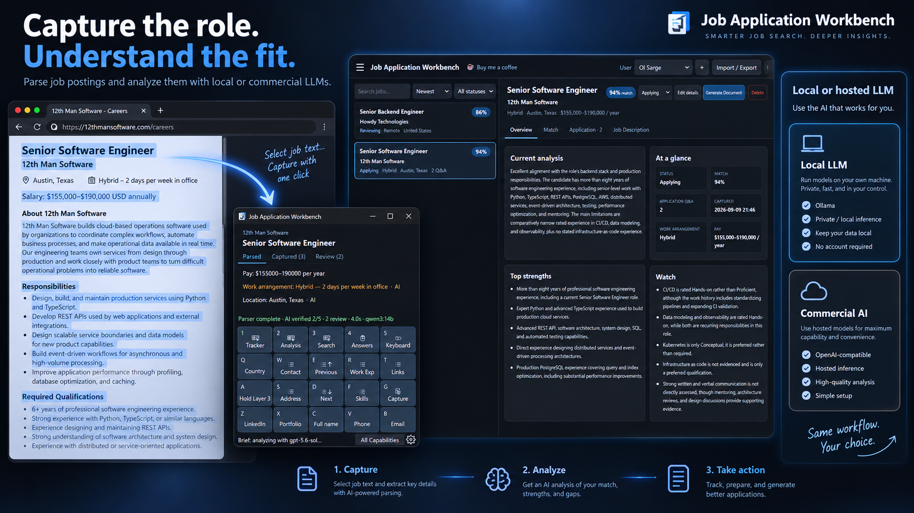
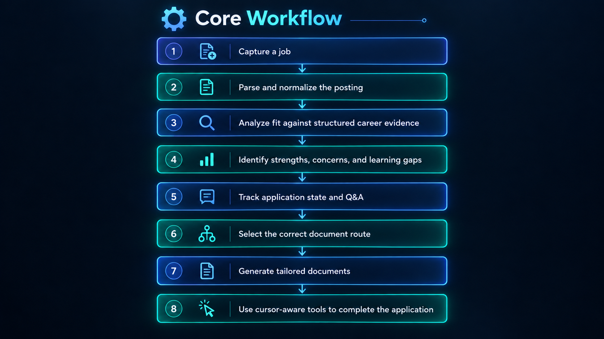
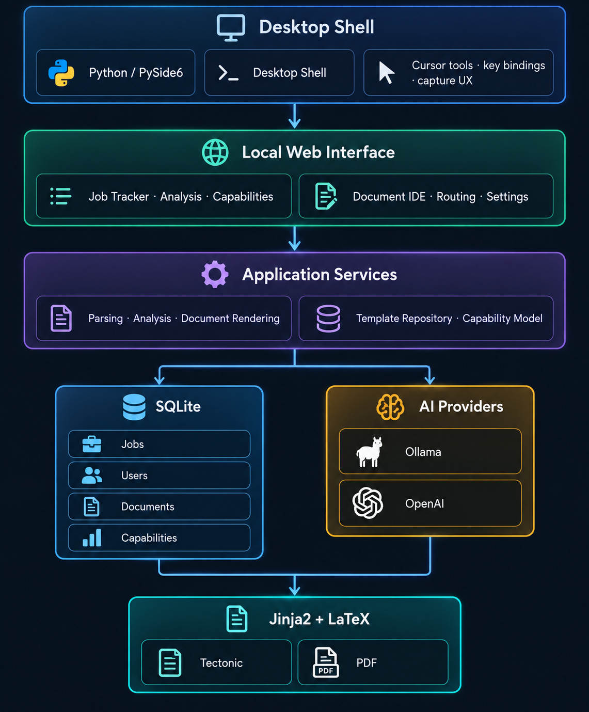
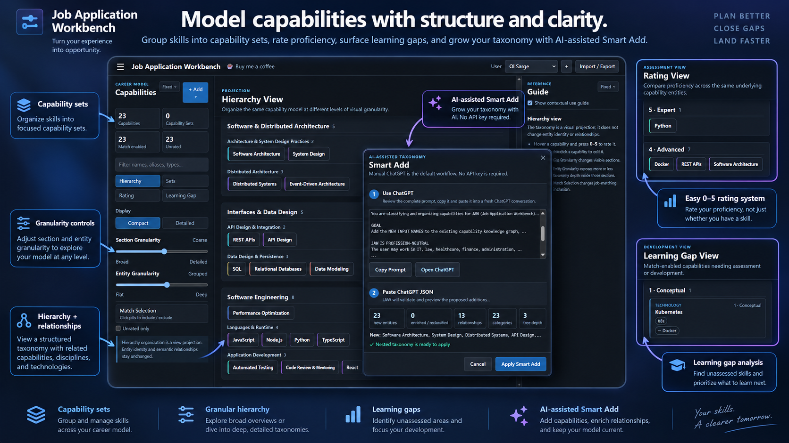
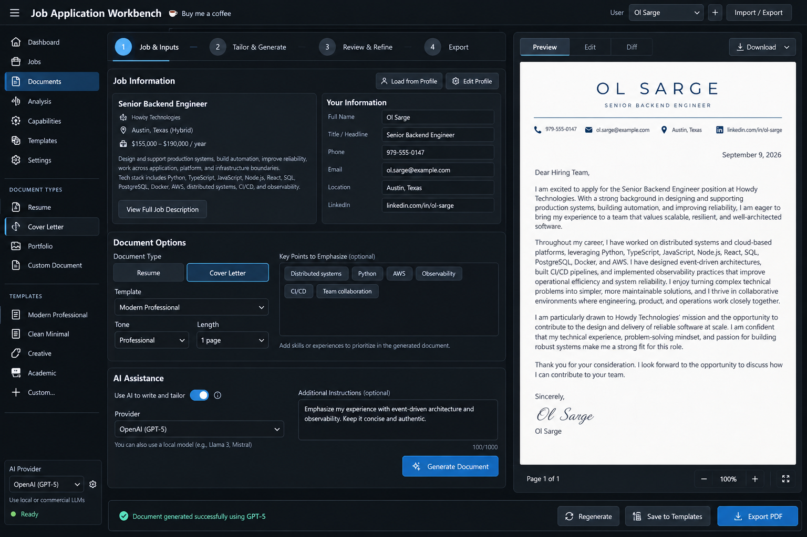

# Job Application Workbench

**JAW** is a Windows-first, local-first desktop application for reducing repetitive work during job applications. It combines reusable application data, keyboard-driven paste workflows, job capture and analysis, application tracking, capability matching, and document generation in one local workspace.

> **Project status:** JAW `v0.1.0` is the initial public alpha release. It is primarily tested on Windows and supports both source installs and automated standalone Windows executable builds.

## Download

[](https://github.com/jimpeel-tech/job-application-workbench/releases/latest/download/JAW.exe)

**Windows:** [Download the latest `JAW.exe`](https://github.com/jimpeel-tech/job-application-workbench/releases/latest/download/JAW.exe). The standalone executable does not require Python to be installed.

[View all releases](https://github.com/jimpeel-tech/job-application-workbench/releases) · [SHA-256 checksum](https://github.com/jimpeel-tech/job-application-workbench/releases/latest/download/JAW.exe.sha256)

[](https://buymeacoffee.com/jimpeel)

<p align="center">
  <a href="visuals/Capture.png">
    
  </a>
</p>

## What JAW does
<p align="center">
  <a href="visuals/workflow.png">
    
  </a>
</p>

- **Desktop application assistant** — configurable global hotkeys and iterators for profile data, work experience, skills, links, and reusable answers.
- **Smart Capture** — capture selected job-description text, parse important fields, and optionally verify/enrich the result with Ollama.
- **Job analysis** — compare a posting with your selected capabilities and work experience using the local analyzer or an explicitly configured AI provider.
- **Job Tracker** — local dashboard for jobs, statuses, captured application questions, analysis results, and application history.
- **User Data** — maintain profile fields, work experience, Q&A, capabilities, ratings, matching state, reusable capability sets, actions, and keybinds.
- **Document Workbench** — compose reusable Documents, Templates, Sections, and Functions with Jinja/LaTeX and job-aware generation.
- **PDF generation** — render documents with the standalone Tectonic TeX engine.
- **Optional Outlook sync** — classify job-related mail with local Ollama and reconcile it with tracked applications.
- **Optional Chrome helper** — reuse the existing JAW dashboard tab instead of opening duplicate tabs.

JAW stores its application data locally in SQLite. The default dashboard is served only through the local JAW process at `http://127.0.0.1:8765`.

<p align="center">
  <a href="visuals/jaw_architecture.png">
    
  </a>
</p>

## Visual tour

<table>
  <tr>
    <td width="50%" valign="top">
      <a href="visuals/Paste%20Assistant.png">
        
      </a>
      <br><strong>Application Assistant</strong><br>
      <sub>Cursor-aware iterators, reusable profile data, work history, links, and configurable keyboard workflows.</sub>
    </td>
    <td width="50%" valign="top">
      <a href="visuals/Capabilities.png">
        
      </a>
      <br><strong>Capability Model</strong><br>
      <sub>Structured capabilities, 0–5 proficiency ratings, relationships, sets, hierarchy projections, learning gaps, and AI-assisted Smart Add.</sub>
    </td>
  </tr>
  <tr>
    <td width="50%" valign="top">
      <a href="visuals/Document%20IDE.png">
        
      </a>
      <br><strong>Document IDE</strong><br>
      <sub>Reusable Jinja/LaTeX Templates, Sections, Functions, AI generation blocks, live preview, PDF generation, and rule-based routing.</sub>
    </td>
    <td width="50%" valign="top">
      <a href="visuals/Documents.png">
        
      </a>
      <br><strong>Tailored Documents</strong><br>
      <sub>Build job-aware resumes and cover letters from structured career evidence using local or hosted generative models.</sub>
    </td>
  </tr>
</table>

_Click any image to view it full size._

## Quick start

### Windows executable

1. [Download the latest `JAW.exe`](https://github.com/jimpeel-tech/job-application-workbench/releases/latest/download/JAW.exe).
2. Run `JAW.exe`.

The standalone executable is the simplest way to try JAW on Windows and does not require a Python installation.

### Install from source

Requirements:

- Windows 10 or Windows 11
- Python 3.11+
- Git

Open PowerShell:

```powershell
git clone https://github.com/jimpeel-tech/job-application-workbench.git
cd job-application-workbench

py -3.11 -m venv .venv
.\.venv\Scripts\Activate.ps1
python -m pip install --upgrade pip
python -m pip install .

jaw
```

A normal installed copy stores writable state under:

```text
%LOCALAPPDATA%\JAW\
├── config.toml
└── data\
    └── jaw.db
```

JAW creates and normalizes its runtime configuration automatically. Set `JAW_HOME` if you want to use a different writable data directory.

See [Installation](docs/installation.md) for executable/source installation and development details. See [Building JAW for Windows](docs/building.md) to build `JAW.exe` locally or through GitHub Actions.

## Optional components

| Component | Purpose | Required? |
| --- | --- | --- |
| [Ollama](docs/ollama.md) | Local generative-AI verification and analysis | No |
| [Tectonic](docs/tectonic.md) | PDF document rendering | Only for PDF generation |
| [Outlook sync](docs/outlook-sync.md) | Reconcile job-related Outlook mail with Job Tracker | No; requires local Ollama when enabled |
| [Chrome extension](chrome-extension/README.md) | Reuse the current JAW dashboard tab | No |

JAW's default Ollama model is `qwen3:14b`. Ollama is not required for the deterministic local parser.

## Basic workflow

1. Start JAW with `jaw`.
2. Open the local **User Data** pages and add the profile, work-experience, Q&A, and capability data you want to reuse.
3. Use the desktop actions while filling an application form.
4. Use **Smart Capture** on selected job-description text.
5. Run **Analysis** when you want to persist/analyze the captured job and review it in **Job Tracker**.
6. Use the **Document Workbench** to generate job-aware application documents when needed.

The initial keybind set is configurable. Current QWERTY defaults include:

```text
1    Job Tracker
2    Analysis
G    Smart Capture
F    Skills iterator
R    Work Experience iterator
```

Keybind assignments are stored by physical matrix position. Switching between QWERTY and Colemak-DH changes the displayed and registered key for each position while keeping the assigned action in the same matrix cell.

Global hotkeys are disabled on startup by default and can be enabled from JAW when you are ready to use them.

## Analysis and privacy

A new JAW profile starts in local analysis mode.

- **Local analyzer** performs deterministic extraction and capability matching without sending the job description to a generative-AI provider.
- **Ollama** connects to the configured Ollama host. With the default localhost configuration, inference traffic stays on the computer running JAW.
- **OpenAI** is optional. When selected, JAW reads the API key from `OPENAI_API_KEY`; the key is not intended to be stored in JAW's SQLite database or runtime configuration.
- **Outlook sync** is disabled by default. When enabled, its email classification/matching path uses local Ollama rather than OpenAI.

If `OLLAMA_HOST` points to another machine, content sent for Ollama inference is transmitted to that host.

## Document generation

The Document Workbench uses a small composition model:

```text
Document
└── Template
    └── Section references
        └── Function references
```

Templates are normally LaTeX + Jinja. Sections hold document-facing content and can use JAW generation features; Functions provide reusable/extracted logic.

PDF rendering uses Tectonic. JAW bundles the open-source Montserrat, Open Sans, and Qwitcher Grypen font families used by its built-in templates, together with their license texts. Additional custom fonts can be supplied with `JAW_TECTONIC_SEARCH_PATH`.

See [Document Workbench](docs/document-workbench.md) and [Tectonic Setup](docs/tectonic.md).

## Outlook sync

Outlook synchronization is opt-in and disabled by default:

```toml
[behavior]
outlook_sync_enabled = false
```

When enabled, JAW uses Microsoft Graph device-code authentication with a public-client application and local Ollama for message classification/matching. See [Outlook Sync Configuration](docs/outlook-sync.md).

## Development

```powershell
git clone https://github.com/jimpeel-tech/job-application-workbench.git
cd job-application-workbench

py -3.11 -m venv .venv
.\.venv\Scripts\Activate.ps1
python -m pip install -e .[dev]

python -m pytest -q
python -m ruff check src tests
```

CI runs the test suite and Ruff on Windows, builds a wheel, verifies required runtime assets, and smoke-tests JAW from the installed wheel rather than relying only on an editable checkout. A separate **Build Windows executable** workflow packages `JAW.exe`; manual runs publish an Actions artifact and `v*` tags attach the executable to the GitHub Release.

## Documentation

- [Installation](docs/installation.md)
- [Building JAW for Windows](docs/building.md)
- [Ollama Setup](docs/ollama.md)
- [Tectonic Setup](docs/tectonic.md)
- [Document Workbench](docs/document-workbench.md)
- [Outlook Sync](docs/outlook-sync.md)

Contributor architecture notes:

- [Workbench Reference Identity](docs/workbench-reference-identity.md)
- [Shared Global Template Graph Semantics](docs/workbench-shared-template-graph.md)

## License

JAW is licensed under the [MIT License](LICENSE).
